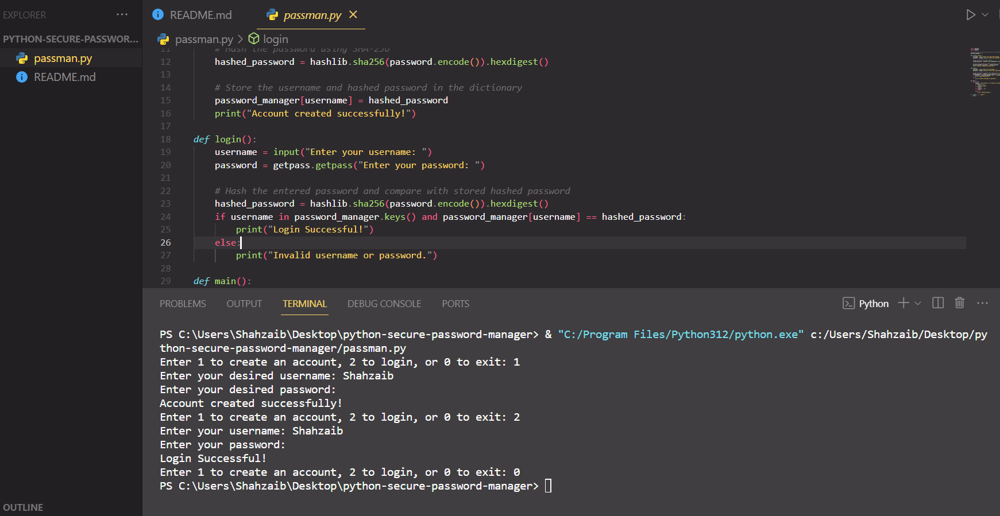

# Python Secure Password Manager

## Overview

A robust Python-based Password Manager fortified with SHA-256 hashing for top-notch cybersecurity. Safely store and manage your credentials, ensuring a secure online experience.

## Features

- **Secure Hashing:**

  - Utilizes SHA-256 hashing for robust password security.

- **Account Management:**
  - Create accounts and login securely with hashed passwords.

## How to Use

1. **Clone this Repository:**
   ```bash
   git clone https://github.com/Shahzaib-D-Memon/python-secure-password-manager.git
   ```
2. **Run the Password Manager:**
   ```bash
   python password_manager.py
   ```
3. **Follow On-screen Instructions:**

- Choose option 1 to create an account or option 2 to login.
- Enter the required information securely.



## Cybersecurity Best Practices:

- Customize the script to fit your specific security needs.
- Explore additional security measures for a production environment.
